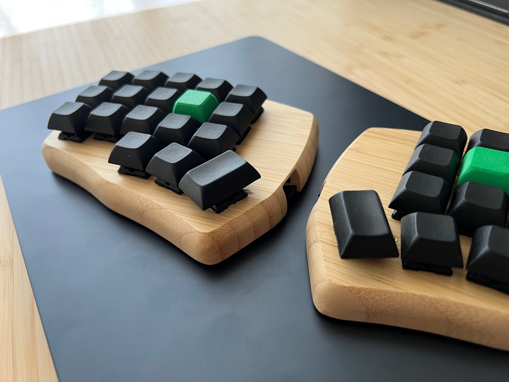
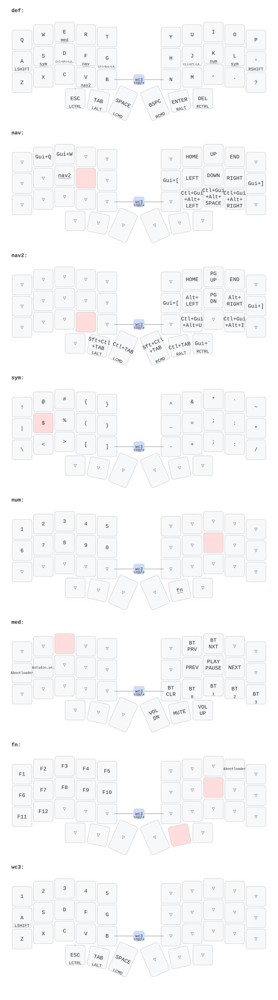
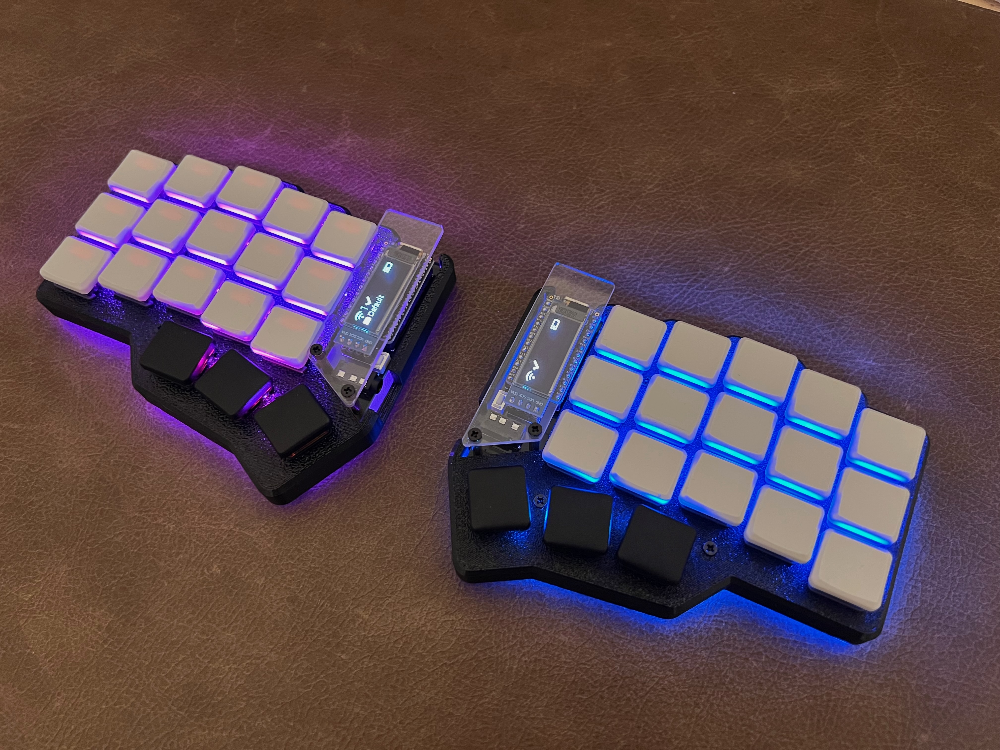
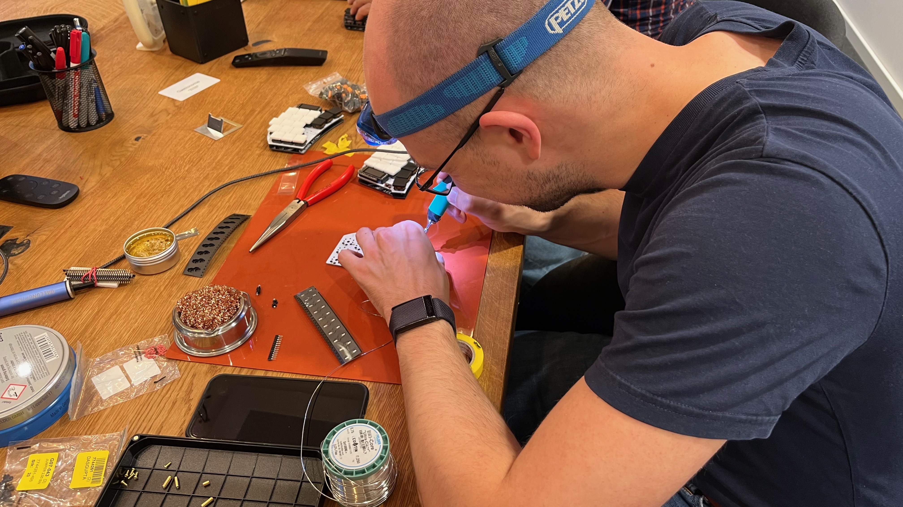
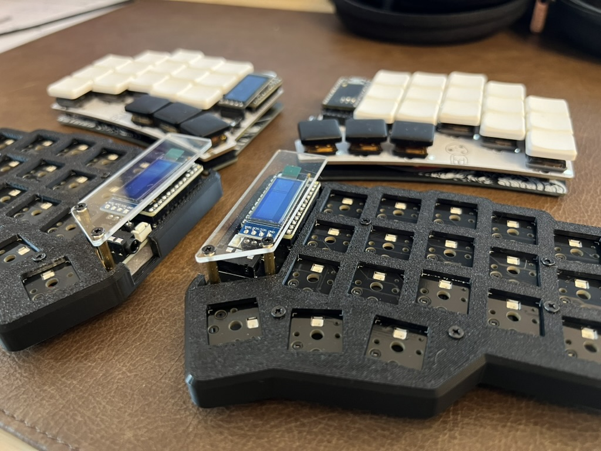

# Keyboard Notes

This is my personal note-space for the firmware and layout of my keyboard.

The current keyboard is a [FalbaTech](https://falbatech.click/) Corne Mini Wireless with nice!nano v2 controllers. It
runs ZMK, has no display, no RGB, and uses ZMK Studio for small changes when I do not want to rebuild firmware.

# Current Keymap

Prior to using the FalbaTech keyboard I first used a self-soldered keyboard and then moved on to a keebmaker-prebuilt,
which I happily used for a year. I then moved on to FalbaTech, because I liked the clean wooden design, and it's just
such a nice business.

